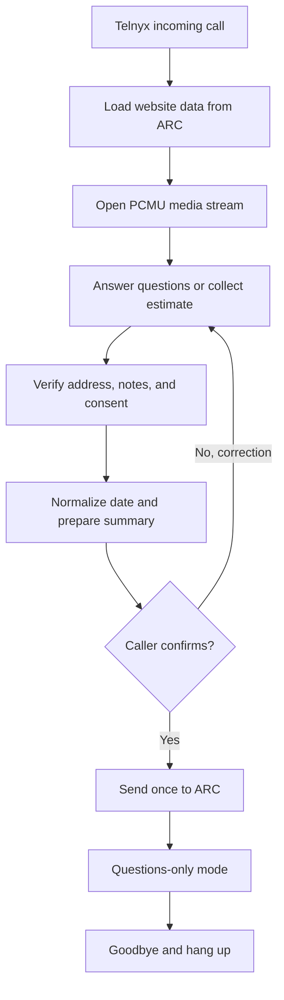

# ARC AI Receptionist

This Railway service connects Telnyx calls to an OpenAI Realtime receptionist. The receptionist receives current business information from ARC, answers callers from that website data, and can send one caller-confirmed estimate request back to ARC.

## Conversation behavior

The receptionist opens with two clear paths: filling out an estimate request (its primary objective) or answering a question about the business. It does not force an estimate on callers who only want information, and it never advertises unsupported topics such as pricing or availability.

During intake it asks exactly one question per turn. Date and time are treated as one scheduling question, while additional notes and contact consent are always separate questions. It immediately reads the complete project address back and waits for explicit confirmation before moving on.

For an estimate, it collects:

1. Website service
2. Caller name
3. Project address
4. Preferred estimate date
5. Preferred estimate time
6. Optional additional notes
7. Explicit consent for the business to contact the caller

The server blocks summary preparation unless the address-confirmation, notes-question, and standalone-consent gates are complete. It converts relative dates such as `Tuesday` into an exact `YYYY-MM-DD` date in the business timezone. The AI must then read back the complete normalized summary and obtain a separate, explicit confirmation before the server permits submission. On that confirmation it says it is submitting the request, then sends it.

After ARC successfully accepts the request, the receptionist says only that the request was successfully submitted and asks whether the caller has any other questions. The live OpenAI session is updated with no intake tools. For the remainder of the call, it answers only questions the caller actually asks and only from website data, or uses the dedicated end-call tool. When the caller says they have no more questions, it gives a short goodbye, waits for that audio to finish playing, and hangs up.

## Cost controls

The default model is `gpt-realtime-2.1-mini`. The service also applies four independent protections:

- A normal response target of about 256 output tokens, with a hard maximum of 800 so important answers and estimate readbacks are not cut off
- Maximum 2,500 post-instruction conversation tokens retained per response
- Maximum 40 AI responses per call
- Maximum 8-minute call duration

Website knowledge sent to the model is capped at 12,000 characters. These defaults keep normal receptionist calls concise and prevent an abandoned or unusually long call from consuming unlimited model usage. Every limit can be adjusted through Railway, but raising a limit increases the possible cost per call.

When Telnyx reports the call ended, Railway logs one `[Call OpenAI usage]` record containing input tokens, output tokens, response count, and a conservative Realtime-model cost upper bound. The bound prices every token at the model's uncached audio rate, so that part of the final OpenAI charge should be no higher and will usually be lower. Caller transcription uses the separate low-cost `gpt-4o-mini-transcribe` model.

Railway also logs each completed caller and receptionist utterance as `[Call transcript line]`, then logs the full ordered call as `[Call transcript]` when the call ends. Caller lines are automatic speech-recognition transcripts; receptionist lines are the generated audio transcripts. These logs contain caller-provided personal information such as names and addresses, so access to Railway logs should stay restricted.

## Call flow



## Required Railway environment variables

```text
TELNYX_API_KEY
OPENAI_API_KEY
PUBLIC_URL or RAILWAY_PUBLIC_DOMAIN
RECEPTIONIST_CONFIG_URL or ARC_RUNTIME_URL
```

Optional:

```text
ARC_INTAKE_URL
OPENAI_REALTIME_MODEL          # defaults to gpt-realtime-2.1-mini
OPENAI_VOICE                   # defaults to marin
OPENAI_TRANSCRIPTION_MODEL     # defaults to gpt-4o-mini-transcribe
OPENAI_TRANSCRIPTION_LANGUAGE  # defaults to en
BUSINESS_TIME_ZONE             # fallback only; defaults to America/New_York
OPENAI_MAX_OUTPUT_TOKENS       # defaults to 800; prompt normally targets about 256
OPENAI_CONTEXT_TOKEN_LIMIT     # defaults to 2500
OPENAI_CONTEXT_RETENTION_RATIO # defaults to 0.7
OPENAI_MAX_RESPONSES_PER_CALL  # defaults to 40
MAX_CALL_DURATION_SECONDS      # defaults to 480 (8 minutes)
MAX_WEBSITE_KNOWLEDGE_CHARACTERS # defaults to 12000
PORT
```

For the current ARK OCM integration, set `RECEPTIONIST_CONFIG_URL` to
`https://ark-websites-ocm-xi.vercel.app/api/receptionist/runtime`. Leave
`ARC_INTAKE_URL` unset: the runtime response supplies the correct private URL for the
business matched to the called Telnyx number. ARC-provided settings take precedence
over the optional intake URL and business timezone fallback. Voice is controlled only
by `OPENAI_VOICE` on Railway and otherwise defaults to `marin`.

## ARC runtime request

For every `call.initiated` webhook, this service forwards the exact original Telnyx
JSON body and its `telnyx-signature-ed25519` and `telnyx-timestamp` headers to the
configured ARC runtime endpoint. ARK verifies that signature before returning any
business information. A simplified incoming Telnyx body looks like:

```json
{
  "data": {
    "event_type": "call.initiated",
    "payload": {
      "call_control_id": "telnyx-call-control-id",
      "from": "+15557654321",
      "to": "+15551234567"
    }
  }
}
```

The ARC response can place public business information in `profile`, `business`, `businessInfo`, `website`, `knowledge`, `faq`, or top-level public business fields. A typical response is:

```json
{
  "ok": true,
  "clientId": "client-id",
  "profile": {
    "businessName": "Example Painting",
    "timeZone": "America/New_York",
    "services": {
      "Interior Painting": "Walls, ceilings, trim, and cabinets",
      "Exterior Painting": "Siding, trim, decks, and fences"
    },
    "businessHours": "Monday through Friday, 8 AM to 5 PM",
    "faqs": []
  },
  "intakeUrl": "https://ark-websites-ocm-xi.vercel.app/api/intake?clientId=CLIENT_ID&key=PRIVATE_CONNECTION_KEY&source=CLIENT_ID-receptionist"
}
```

Tokens, secrets, credentials, connection URLs, and legacy receptionist-name/voice controls are removed before website data is placed in the AI prompt.

## ARC estimate payload

After consent, readback, and confirmation, the intake endpoint receives one request with an `Idempotency-Key` header and this JSON shape:

```json
{
  "type": "estimate_request",
  "clientId": "client-id",
  "callControlId": "telnyx-call-control-id",
  "source": "ai_receptionist",
  "callerPhone": "+15557654321",
  "service": "Interior Painting",
  "name": "Jordan Smith",
  "address": "123 Main Street, Albany, NY 12207",
  "requestedDate": "2026-08-11",
  "requestedTime": "3:30 PM",
  "additionalNotes": "The living room has vaulted ceilings.",
  "consentToContact": true,
  "summaryConfirmed": true,
  "submittedAt": "2026-08-04T21:00:00.000Z",
  "Name": "Jordan Smith",
  "Phone": "+15557654321",
  "Address": "123 Main Street, Albany, NY 12207",
  "Job": "Interior Painting",
  "PreferredDate": "2026-08-11",
  "PreferredTime": "3:30 PM",
  "Notes": "The living room has vaulted ceilings."
}
```

ARC should return JSON with a successful HTTP status. `{ "ok": false }` or `{ "success": false }` is treated as a failed save, and the receptionist will not claim the request was sent.

## Endpoints

```text
GET  /
GET  /health
POST /voice-api-webhook
POST /arc/send
WS   /media-stream
```

## Local verification

```bash
npm install
npm run check
npm test
```

Live call testing additionally requires valid Telnyx, OpenAI, Railway, and ARC credentials. Never commit those values or caller data.
