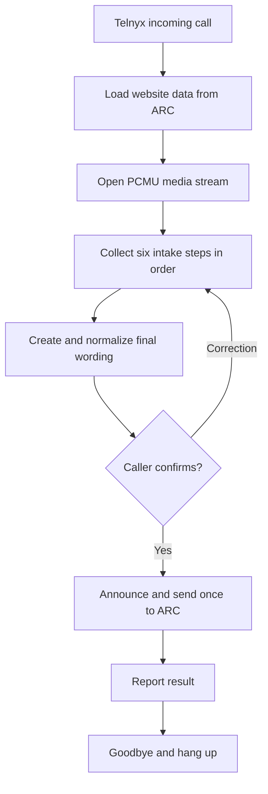

# ARC AI Receptionist

This Railway service connects Telnyx calls to an OpenAI Realtime receptionist. The receptionist receives current business information from ARC, answers callers from that website data, and can send one caller-confirmed service request back to ARC.

## Conversation behavior

The receptionist follows one server-owned intake sequence for every configured business:

1. Service
2. Caller name
3. Full project address
4. Preferred service-request day and morning/afternoon window
5. Additional notes
6. Standalone consent to be contacted
7. Final readback and separate caller confirmation
8. Submission result, goodbye, and hangup

One conversation controller owns all completed fields and the current step. The language model interprets the caller's natural speech, but it cannot reorder the flow, reopen a completed field, prepare a summary, submit a request, or end the call. If the caller volunteers several details together, all grounded details are retained and the receptionist asks only for the next missing field.

General language understanding is used for names, addresses, days, time windows, corrections, unfinished thoughts, and matching requested work to the business's supplied services. Business, trade, price, duration, method, and policy answers must have an exact supporting fact in ARC-provided business information. The receptionist may explain ARC-supplied service-request days and hours, but it never claims that a specific appointment is available; it records a preferred day and morning/afternoon window for the business to confirm. If no supported answer exists, the receptionist says it does not know, saves the caller's actual question once in the notes, and resumes the same intake step.

Notes and business questions are separate meanings. Useful scope, location, quantity, condition, material, and color details given while answering the service question are retained as concise, owner-facing project notes even if the language model omits its optional note extraction. Fillers, false starts, repeated clauses, and standalone hesitations are excluded. Unsupported business questions are reduced to one direct question before being saved. A project detail ending in a conversational phrase such as “you know what I mean?” remains a note. Schedule answers and schedule corrections never become notes. After a note is acknowledged, later turns do not repeat or paraphrase it. Empty notes are omitted from the final readback.

Once the project information is complete, one dedicated final-summary job reviews the complete caller evidence and verified request state with `gpt-5.6-luna`. Strict structured output returns only a concise service label and zero to two owner-facing note sentences. On regular numbers, the configured service name is locked and cannot be rewritten; on the demo number, Luna produces the concise work label. Name, address, preferred day, and time window remain server-owned fields and are never regenerated by the summary model. The same final wording is used in both the spoken readback and the saved four-line bullet summary, so the caller does not approve one version while ARC receives another. The summary job begins while the contact-consent question is being spoken to hide its latency. If Luna is unavailable, the existing Realtime model performs one dedicated whole-request summary before the server uses its deterministic emergency fallback.

The server normalizes relative dates such as `Tuesday` and ordinal days such as `the 10th` in the business timezone and rejects requests outside ARC-supplied service-request days. It stores only `Morning`, `Afternoon`, or `Flexible` as the caller's preference. A volunteered exact time is reduced to its broad window; a clock time without a clear window triggers a morning-or-afternoon question, never an AM-or-PM clarification.

After notes and standalone contact consent are complete, the server prepares the final readback. Contact consent cannot double as summary confirmation. The caller must separately confirm the complete readback before submission. The receptionist then says it is submitting, performs one idempotent ARC write, reports success or failure, says goodbye, waits for the audio playback mark, and hangs up. There is no post-submission question mode.

### Dedicated demo number

Calls to **(774) 231-6164** are identified locally before any ARC-account lookup. Every other called number continues through the normal ARC-account runtime path. The demo follows the same intake order and final readback as a normal receptionist, but it accepts any substantive type of requested work instead of matching against a business service catalog. A non-service answer cannot complete the service step.

The demo accepts preferred service-request days Monday through Friday in the `America/New_York` timezone and records a morning or afternoon window. Every separate business-information question receives the fixed response, “I'm sorry, I don't know that, but you can submit a service request,” after which the still-pending intake question resumes. Question-shaped requests for actual work, such as “Can you mow my lawn?”, are accepted as services.

The greeting explains that the caller can pretend to be one of their own clients and that the provided information is not saved. Demo calls do not write to ARC, run the lead-risk/delivery path, invoke the configured delivery callback, retain caller/receptionist transcripts in this service, or claim that a request was submitted. Once the caller confirms the final readback, the demo says, “Thank you for calling the demo number. Have a good day,” and hangs up after playback completes.

## Turn taking and recovery

Incoming audio uses far-field noise reduction and semantic voice activity detection. OpenAI does not automatically create or interrupt responses: caller turns are analyzed by the server-controlled flow. The first delivery of every question—including an immediate clarification—finishes without caller barge-in. If the caller stays silent for five seconds and the receptionist repeats the pending question, that timed repeat yields immediately when the caller starts answering; other caller speech remains queued until the active prompt finishes.

Meaningful caller turns first use one forced, silent analysis tool call; the Realtime model listens to the native caller audio as the primary evidence and the controller then requests only the exact next spoken turn. The separate transcription model is a sidecar for regular-number logs and a literal cross-check, not the authority on what the caller meant. A missing, empty, or incorrect sidecar transcript therefore cannot force a bad answer or unnecessary repeated question: native-audio analysis continues normally. Split caller phrases are recombined even if the first analysis has finished. Reactions, background speech, and unfinished thoughts do not advance a field. After five seconds without a caller response, measured from the end of receptionist playback, the receptionist repeats only the pending question. Empty transcription generated during receptionist audio cannot start an early duplicate prompt. A caller who says “hold on” gets 30 seconds before the receptionist asks whether they are still there; speaking sooner cancels that timer. Missing tool calls and failed speech responses also have bounded recovery paths.

## Cost controls

The default live model is `gpt-realtime-2.1-mini`. Final whole-request wording defaults to `gpt-5.6-luna` with reasoning disabled and strict structured output. The service also applies four independent protections:

- Maximum 800 output tokens per model response so important service-request readbacks are not cut off
- Maximum 2,500 post-instruction conversation tokens retained per response
- Maximum 40 AI responses per call
- Maximum 8-minute call duration

Website knowledge sent to the model is capped at 12,000 characters. These defaults keep normal receptionist calls concise and prevent an abandoned or unusually long call from consuming unlimited model usage. Every limit can be adjusted through Railway, but raising a limit increases the possible cost per call.

When Telnyx reports the call ended, Railway logs one `[Call OpenAI usage]` record containing input tokens, output tokens, response count, and a conservative Realtime-model cost upper bound. The bound prices every token at the model's uncached audio rate, so that part of the final OpenAI charge should be no higher and will usually be lower. Caller transcription uses the separately configured sidecar transcription model. It remains useful for searchable regular-number logs, but it is no longer the source of truth for live understanding or final summarization.

Railway also logs each completed caller and receptionist utterance as `[Call transcript line]`, then logs the full ordered call as `[Call transcript]` when the call ends. Caller lines are automatic speech-recognition transcripts; receptionist lines are the generated audio transcripts. These logs contain caller-provided personal information such as names and addresses, so access to Railway logs should stay restricted.

When a connected media stream ends, Railway also sends one idempotent usage record to the private `usageUrl` supplied by ARK. Timing starts only after Telnyx confirms the AI media stream started, so failed startup attempts are not billed. The record includes the call identifier, timestamps, duration, outcome, and whether a service request was saved. It does not include the caller's phone number, name, address, transcript, or project details. The connection credential is sent in a request header rather than the URL. Temporary delivery failures are retried three times, and ARK deduplicates repeat delivery by call ID.

For each substantive caller turn, Railway logs `[Call latency]` with speech-stop-to-transcript time, speech-stop-to-first-audio time, caller-transcript-to-first-audio time, silent analysis time, and speech-generation time. These measurements separate transcription delay from model analysis and audio generation.

## Call flow



## Required Railway environment variables

```text
TELNYX_API_KEY
OPENAI_API_KEY
PUBLIC_URL or RAILWAY_PUBLIC_DOMAIN
RECEPTIONIST_CONFIG_URL or ARC_RUNTIME_URL
```

Optional:

```text
ARC_INTAKE_URL
OPENAI_REALTIME_MODEL          # defaults to gpt-realtime-2.1-mini
OPENAI_VOICE                   # defaults to marin
OPENAI_TRANSCRIPTION_MODEL     # defaults to gpt-live-transcribe
OPENAI_TRANSCRIPTION_LANGUAGE  # defaults to en
OPENAI_SUMMARY_MODEL           # defaults to gpt-5.6-luna
OPENAI_SUMMARY_TIMEOUT_MS      # defaults to 6000; bounded from 1000 to 20000
OPENAI_CALLER_SILENCE_REPROMPT_MS # defaults to 5000
OPENAI_HOLD_REPROMPT_MS          # defaults to 30000
BUSINESS_TIME_ZONE             # fallback only; defaults to America/New_York
OPENAI_MAX_OUTPUT_TOKENS       # defaults to 800
OPENAI_ANALYSIS_MAX_OUTPUT_TOKENS # defaults to 2048; retries may use 4096
OPENAI_CONTEXT_TOKEN_LIMIT     # defaults to 2500
OPENAI_CONTEXT_RETENTION_RATIO # defaults to 0.7
OPENAI_MAX_RESPONSES_PER_CALL  # defaults to 40
MAX_CALL_DURATION_SECONDS      # defaults to 480 (8 minutes)
MAX_WEBSITE_KNOWLEDGE_CHARACTERS # defaults to 12000
GOOGLE_MAPS_API_KEY            # enables Google Address Validation risk checks
GOOGLE_MAPS_REGION_CODE        # defaults to US
RISK_LOOKUP_TIMEOUT_MS         # defaults to 8000; bounded from 1000 to 20000
PORT
```

For the current ARK OCM integration, set `RECEPTIONIST_CONFIG_URL` to
`https://ark-websites-ocm.vercel.app/api/receptionist/runtime`. Leave
`ARC_INTAKE_URL` unset: the runtime response supplies the correct private URL for the
business matched to the called Telnyx number. ARC-provided settings take precedence
over the optional intake URL and business timezone fallback. Voice is controlled only
by `OPENAI_VOICE` on Railway and otherwise defaults to `marin`.

## ARC runtime request

For every `call.initiated` webhook, this service forwards the exact original Telnyx
JSON body and its `telnyx-signature-ed25519` and `telnyx-timestamp` headers to the
configured ARC runtime endpoint. ARK verifies that signature before returning any
business information. A simplified incoming Telnyx body looks like:

```json
{
  "data": {
    "event_type": "call.initiated",
    "payload": {
      "call_control_id": "telnyx-call-control-id",
      "from": "+15557654321",
      "to": "+15551234567"
    }
  }
}
```

The ARC response can place public business information in `profile`, `business`, `businessInfo`, `website`, `knowledge`, `faq`, or top-level public business fields. A typical response is:

```json
{
  "ok": true,
  "clientId": "client-id",
  "profile": {
    "businessName": "Example Painting",
    "timeZone": "America/New_York",
    "serviceRequestWeekdays": ["monday", "tuesday", "wednesday", "thursday", "friday"],
    "earliestServiceRequestStart": "09:00",
    "latestServiceRequestStart": "16:00",
    "serviceAreas": ["New York", "Albany County", "Rensselaer County"],
    "serviceAreaMode": "counties",
    "serviceAreaStates": ["New York"],
    "serviceAreaCounties": ["Albany County", "Rensselaer County"],
    "services": {
      "Interior Painting": "Walls, ceilings, trim, and cabinets",
      "Exterior Painting": "Siding, trim, decks, and fences"
    },
    "businessInformation": [
      {
        "title": "Warranty",
        "info": "One year on labor."
      }
    ],
    "faqs": []
  },
  "intakeUrl": "https://ark-websites-ocm.vercel.app/api/intake?clientId=CLIENT_ID&key=PRIVATE_CONNECTION_KEY&source=CLIENT_ID-receptionist"
}
```

Service-request weekdays and start times are optional. The receptionist records the caller's preferred day and broad time window without claiming a confirmed appointment. The older `estimateDays`, `estimateWeekdays`, `earliestEstimateStart`, and `latestEstimateStart` runtime fields remain accepted as compatibility aliases, but all new ARC data and caller-facing language should use the service-request names. Owner-supplied Title/Info items are available for grounded business-question answers. Legacy business-hours fields, tokens, secrets, credentials, connection URLs, and legacy receptionist-name/voice controls are removed before website data is placed in the AI prompt.

Service areas have two supported modes: `states` means one or more whole states with no county list; `counties` means exactly one state plus one or more counties in that state. The risk check uses the structured arrays when ARC supplies them and keeps the flat `serviceAreas` field as a compatibility fallback.

## Receptionist-side risk assessment

The receptionist performs the checks after the caller confirms the final readback and before delivery to ARC. The spoken sequence is: announce that the service request is being sent, run the Telnyx and Google checks, calculate the score, deliver the enriched request to ARC, and only then report that the request was sent. ARC does not need to recalculate the score. Telnyx requests carrier plus caller-name data, and Google Address Validation checks the completed service address.

If `GOOGLE_MAPS_API_KEY` has not been added yet, the address check is marked `not_configured` and contributes no points. An API outage is marked `error` and also does not falsely label the address invalid. Only a completed Google validation result that cannot verify an actual premise adds the four-point address warning. A Telnyx lookup failure or invalid caller number does add four points, as specified.

| Check | Points |
|---|---:|
| Verified address, working phone lookup, and no warning signs | 0 |
| Service address outside the configured county/service area | +1 |
| Telnyx phone state differs from the verified service-address state | +1 |
| VoIP phone number | +1 |
| Telnyx lookup succeeds but caller name is unavailable | +1 |
| Telnyx caller name clearly differs from the supplied customer name | +2 |
| Google cannot verify the full service address as an actual address | +4 |
| Required-information resistance: 0–1 / 2–3 / 4–5 / 6+ occurrences | 0 / +1 / +2 / +3 |
| Telnyx lookup fails or the caller number appears invalid | +4 |

| Total | Classification |
|---:|---|
| 0–2 | Low risk 🟢 |
| 3–5 | Moderate risk 🟡 |
| 6–8 | High risk 🟠 |
| 9+ | Very high risk 🔴 |

The resistance counter increases when a caller refuses a required intake field or asks why required information is needed. One confused or annoyed response therefore remains zero-point behavior. Risk details are intentionally not spoken to the caller.

## ARC service-request payload

After consent, readback, and confirmation, the intake endpoint receives one request with an `Idempotency-Key` header and this JSON shape:

```json
{
  "type": "service_request",
  "requestType": "service_request",
  "clientId": "client-id",
  "callControlId": "telnyx-call-control-id",
  "source": "ai_receptionist",
  "callerPhone": "+15557654321",
  "service": "Interior Painting",
  "name": "Jordan Smith",
  "address": "123 Main Street, Albany, NY 12207",
  "requestedDate": "2026-08-11",
  "requestedTime": "3:30 PM",
  "additionalNotes": "The living room has vaulted ceilings.",
  "consentToContact": true,
  "summaryConfirmed": true,
  "customerResistanceCount": 0,
  "submittedAt": "2026-08-04T21:00:00.000Z",
  "riskAssessment": {
    "addressVerified": true,
    "outsideServiceArea": false,
    "phoneLookupFailed": false,
    "phoneLocationMismatch": false,
    "phoneIsVoip": false,
    "callerNameUnavailable": false,
    "callerNameMismatch": false,
    "resistanceCount": 0
  },
  "riskScore": 0,
  "riskLevel": "low",
  "riskFactors": [],
  "risk": {
    "version": 1,
    "score": 0,
    "level": "low",
    "label": "Low risk",
    "indicator": "green",
    "emoji": "🟢",
    "factors": [],
    "checks": {
      "address": {
        "status": "verified",
        "formattedAddress": "123 Main Street, Albany, NY 12207, USA",
        "locality": "Albany",
        "county": "Albany County",
        "state": "NY",
        "postalCode": "12207",
        "serviceAreaStatus": "inside"
      },
      "phone": {
        "status": "verified",
        "lineType": "wireless",
        "carrierName": "Example Wireless",
        "callerName": "Jordan Smith",
        "city": "Albany",
        "state": "NY",
        "locationMatchesAddress": true,
        "callerNameMatches": true
      },
      "customerResistance": {
        "count": 0,
        "points": 0
      }
    },
    "assessedAt": "2026-08-04T21:00:00.000Z"
  },
  "Name": "Jordan Smith",
  "Phone": "+15557654321",
  "Address": "123 Main Street, Albany, NY 12207",
  "Job": "Interior Painting",
  "PreferredDate": "2026-08-11",
  "PreferredTime": "3:30 PM",
  "Notes": "The living room has vaulted ceilings."
}
```

ARC should return JSON with a successful HTTP status. `{ "ok": false }` or `{ "success": false }` is treated as a failed save, and the receptionist will not claim the request was sent.

## Endpoints

```text
GET  /
GET  /health
POST /voice-api-webhook
POST /arc/send
WS   /media-stream
```

## Local verification

```bash
npm install
npm run check
npm test
```

Live call testing additionally requires valid Telnyx, OpenAI, Railway, and ARC credentials. Never commit those values or caller data.
